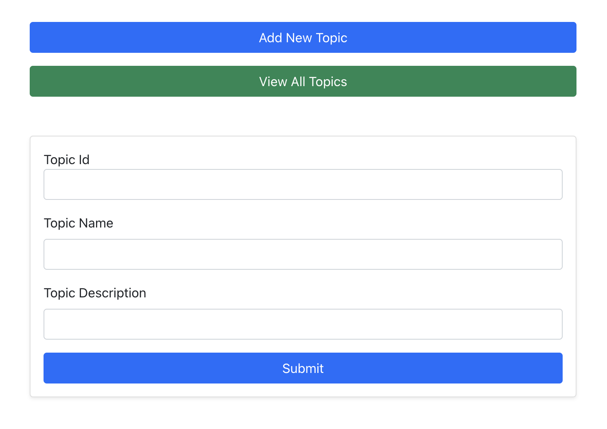
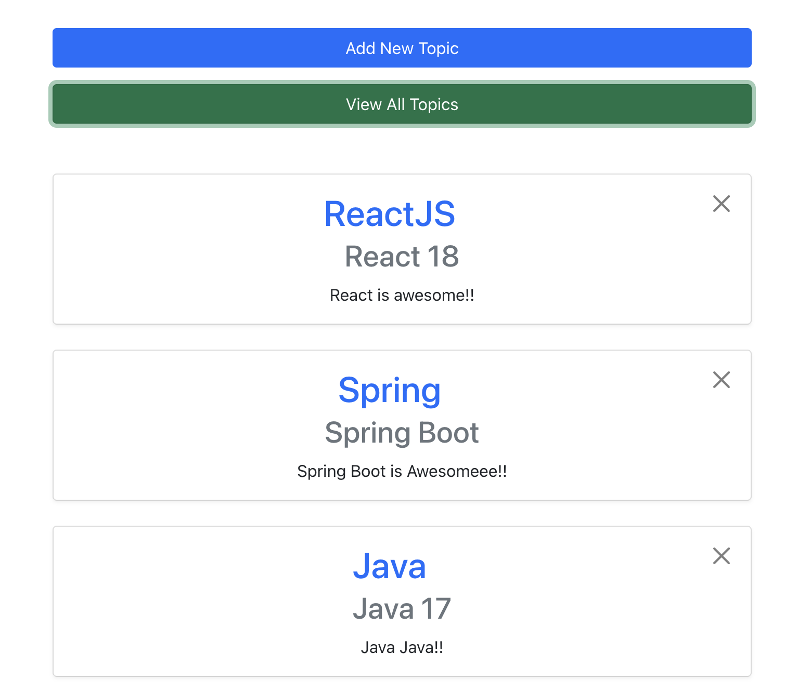

# Topics card app front-end

> New
> Topic Card



> Topic Cards list



## How to run

In the project directory, you can run:

> ### `npm start`

Runs the app in the development mode.\
Open [http://localhost:3000](http://localhost:3000) to view it in your browser.

To set the _REACT_APP_API_URL_, create .env file and set the environment variable:

```python
REACT_APP_API_URL = "API_SERVER_URL"
```

The page will reload when you make changes.\
You may also see any lint errors in the console.

### `npm run build`

Builds the app for production to the `build` folder.\
It correctly bundles React in production mode and optimizes the build for the best performance.
